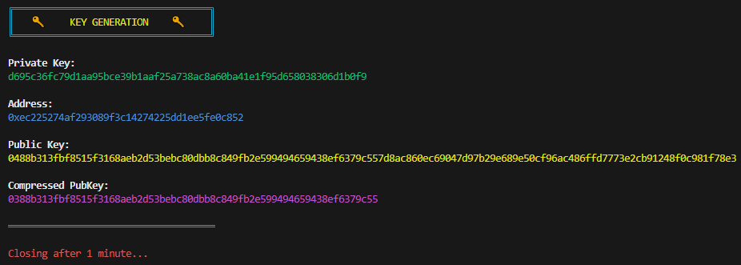
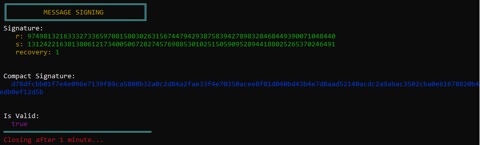
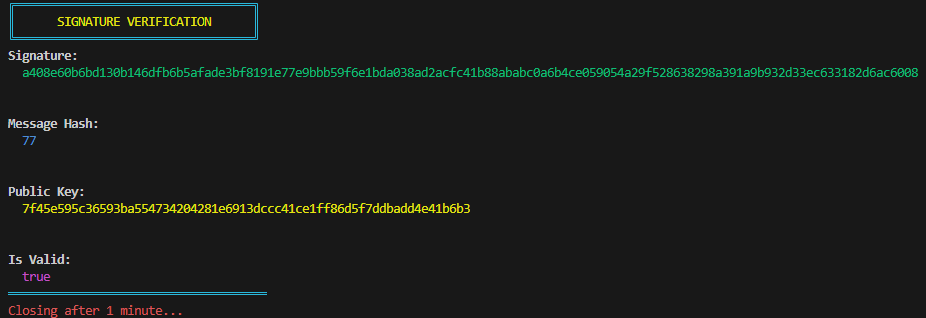

# Executable Keypairs

Contains executables for generating a keypair, signing a message, and verifying a message.

_This repo relies entirely on [Paul Miller](https://github.com/paulmillr)'s [@noble/secp256k1](https://github.com/paulmillr/noble-secp256k1) and [@noble/hashes](https://github.com/paulmillr/noble-hashes) libraries._

## Scripts

You don't need to use the executables at all, you can interact with the source code directly.

### Generating a keypair

```shell
node create.js
```

### Signing a message

_Remove the `0x` prefix from hex strings before calling the function._

```shell
node sign.js
```

### Verifying a message

_The public key, `pubKey`, can be compressed or uncompressed. When inputting a hex string, remove the `0x` prefix before calling the function._

```shell
node verify.js
```

## Executables

### Details

- **Platform:** Windows
- **Arch:** x64
- **Node:** v16.17.1

### Checksum

#### Commands

Powershell:

`Get-FileHash -Algorithm SHA256 <FILE_PATH>`

Bash:

`shasum -a256 <FILE_PATH>`

#### SHA256 Hashes

Create.exe

`ad82f2c1ae51104341ed80110381876634e2b4aa59e604e1096bc54eb2e13d2f`

Sign.exe

`12117dc3e9fdd65695d02d4110767420c45b0281bcd38d7e07b7daeb7c5f4fff`

Verify.exe

`7008c810fa3b6279b613dcda1a13b17441fbe91315f79181b0ee353f78859ecb`

### Rebuild

The steps I took to build the executables are listed below.

Install nexe globally (I used version `4.0.0-rc.6`):

```shell
npm i -g nexe
```

Create.js:

```shell
nexe create.js -o create.exe --build --target windows-x64-16.17.1
```

Sign.js:

```shell
nexe sign.js -o sign.exe --build --target windows-x64-16.17.1
```

Verify.js:

```shell
nexe verify.js -o verify.exe --build --target windows-x64-16.17.1
```

## Output

Images of what will be displayed in the terminal after running the scripts/executables.

## Create



## Sign



## Verify


