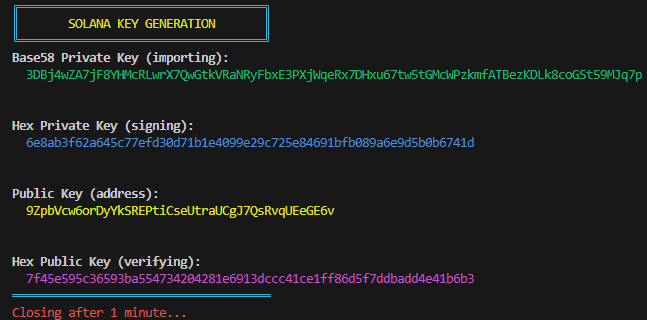

# Executable Keypairs

Contains executables for generating a keypair, signing a message, and verifying a message.

_This repo relies entirely on [Paul Miller](https://github.com/paulmillr)'s [@noble/secp256k1](https://github.com/paulmillr/noble-secp256k1) and [@noble/hashes](https://github.com/paulmillr/noble-hashes) libraries._

## Scripts

You don't need to use the executables at all, you can interact with the source code directly.

### Generating a keypair

```shell
node scripts/create.js
```

### Signing a message

_Remove the `0x` prefix from hex strings before calling the function._

```shell
node scripts/sign.js
```

### Verifying a message

_The public key, `pubKey`, can be compressed or uncompressed. When inputting a hex string, remove the `0x` prefix before calling the function._

```shell
node scripts/verify.js
```

## Executables

### Details

- **Platform:** Windows
- **Arch:** x64
- **Node:** v16.17.1

### Checksum

#### Commands

Powershell:

`Get-FileHash -Algorithm SHA256 <FILE_PATH>`

Bash:

`shasum -a256 <FILE_PATH>`

#### SHA256 Hashes

Create.exe

`c375fec136f713f5e6cf77bfa271e746eb0179bfa68c6bc503bb75dbb983579a`

Sign.exe

`37127d4922cc2dbea600d133c8f2f25660ed294ed405ab5bc8eafb2af55ebefe`

Verify.exe

`337ca20424b2ccd7697c5d3e829de24ac3418ee75c9d86f045774ebd76220d27`

### Rebuild

The steps I took to build the executables are listed below.

Install nexe globally (I used version `4.0.0-rc.6`):

```shell
npm i -g nexe
```

Create.js:

```shell
nexe scripts/create.js -o executables/create.exe --build --target windows-x64-16.17.1
```

Sign.js:

```shell
nexe scripts/sign.js -o executables/sign.exe --build --target windows-x64-16.17.1
```

Verify.js:

```shell
nexe scripts/verify.js -o executables/verify.exe --build --target windows-x64-16.17.1
```

## Output

Images of what will be displayed in the terminal after running the scripts/executables.

## Create



## Sign


## Verify


