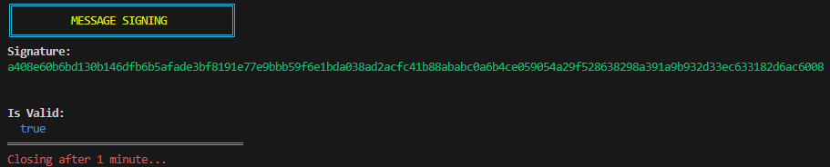

# Keypair.exe - Solana

Contains executables, created with [Nexe](https://github.com/nexe/nexe), for generating a keypair, signing a message, and verifying a message.

_This repo relies entirely on [Paul Miller](https://github.com/paulmillr)'s [@noble/ed25519](https://github.com/paulmillr/noble-ed25519) and [@noble/hashes](https://github.com/paulmillr/noble-hashes) libraries, as well as the [bs58](https://www.npmjs.com/package/bs58) library._

## Scripts

You don't need to use the executables at all, you can interact with the source code directly.

### Generating a keypair

```shell
node create.js
```

### Signing a message

_Remove the `0x` prefix from hex strings before calling the function._

```shell
node sign.js
```

### Verifying a message

_The public key, `pubKey`, can be compressed or uncompressed. When inputting a hex string, remove the `0x` prefix before calling the function._

```shell
node verify.js
```

## Executables

### Details

- **Platform:** Windows
- **Arch:** x64
- **Node:** v16.17.1

### Checksum

#### Commands

There are `scripts` inside the `package.json` for both Powershell and Bash.

Powershell:

`Get-FileHash -Algorithm SHA256 <FILE_PATH>`

Bash:

`shasum -a256 <FILE_PATH>`

Package.json:

```json
"scripts": {
    "create": "node create.js",
    "sign": "node sign.js",
    "verify": "node verify.js",
    "build-create": "nexe create.js -o _create.exe --build --target windows-x64-16.17.1",
    "build-sign": "nexe sign.js -o _sign.exe --build --target windows-x64-16.17.1",
    "build-verify": "nexe verify.js -o _verify.exe --build --target windows-x64-16.17.1",
    "hash-shell-create": "powershell -Command \"get-FileHash _create.exe\"",
    "hash-shell-sign": "powershell -Command \"get-FileHash _sign.exe\"",
    "hash-shell-verify": "powershell -Command \"get-FileHash _verify.exe\"",
    "hash-bash-create": "bash -c \"shasum -a 256 _create.exe\"",
    "hash-bash-sign": "bash -c \"shasum -a 256 _sign.exe\"",
    "hash-bash-verify": "bash -c \"shasum -a 256 _verify.exe\""
  }
```

#### SHA256 Hashes

Create.exe

`7c51611b979aca326b37a67b2e591b9ce60d1a5e93bcb2af1ccd1c48c15449fd`

Sign.exe

`239e54ef86339da8ec2f17581d28f51ba77a07506de4c3771614c769d88df25f`

Verify.exe

`600f52902cc3dbbf02e360b7927dae8096d1394e0fc03ca89204f9aa3fcf83f5`

### Rebuild

The steps I took to build the executables are listed below.

Install nexe globally (I used version `4.0.0-rc.6`):

```shell
npm i -g nexe
```

Create.js:

```shell
nexe create.js -o _create.exe --build --target windows-x64-16.17.1
```

Sign.js:

```shell
nexe sign.js -o _sign.exe --build --target windows-x64-16.17.1
```

Verify.js:

```shell
nexe verify.js -o _verify.exe --build --target windows-x64-16.17.1
```

## Output

Images of what will be displayed in the terminal after running the scripts/executables.

## Create


## Sign



## Verify


